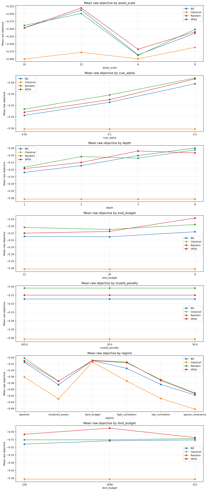

# PortfolioQAOA Characterisation Study

**Short description:** Hardware-aware characterisation platform for constrained QAOA portfolio optimization under shared runtime, shot, queue, and billing budgets.



**Headline result.** Across the completed multi-regime suite, Classical Markowitz delivered the best mean raw objective in every reported study slice while Bayesian Optimization still reached a `100.00%` feasible-hit rate; in the separate mixer pilot, the `xy` mixer won `17/24` quantum-only paired comparisons (`results/multi_regime_suite/suite_report.md`, `results/mixer_dominance_pilot_v2/mixer_dominance_report.md`).

This repo studies not just whether QAOA can run, but whether its extra optimization complexity is justified under realistic resource limits.

## Quick read

- [Results at a glance (PDF)](docs/results_at_a_glance.pdf)
- [Decision map](docs/decision_map.md)
- [When BO was not worth it](docs/when_bo_was_not_worth_it.md)

PortfolioQAOA is a reproducible **characterisation study platform** for constrained QAOA portfolio optimization. It is built to answer one core question:

> **When is a more sophisticated classical optimizer actually worth its runtime, shot, queue, and mitigation cost for constrained QAOA?**

This repo is not positioned as a toy VQE script or a single-demo optimizer comparison. It is a research instrument that combines structured portfolio regimes, a classical Markowitz baseline, fair optimizer accounting, backend-aware execution, QUBO-structure diagnostics, and report generation into one comparative loop.

## What problem this project is solving

Most small quantum-optimization repos only answer a shallow question:
- "Which optimizer got the best score on one example?"

This repo is built to answer the harder and more useful question:
- when does Bayesian Optimization really justify its extra hybrid-loop cost?
- when is SPSA the better robustness tradeoff?
- when is a classical Markowitz solve already strong enough that QAOA tuning is not justified?
- when is Random Search cheap enough that sophistication is not worth it?
- when does feasibility handling dominate optimizer quality?
- when do topology, noise, and billing assumptions change the winner?

## What this repo contributes

The current codebase demonstrates:
- **multi-regime constrained portfolio generation** with exact feasible references on small instances
- **constraint-aware QAOA benchmarking** with CVaR-style objectives, feasibility tracking, and valid-ratio histories
- **strict hybrid-loop accounting** across objective calls, effective shots, transpilation time, execution time, queue latency, billed time, and estimated QPU cost
- **fair optimizer comparison** across a classical Markowitz baseline, Random Search, SPSA, and Bayesian Optimization under shared budgets and shared evaluation plumbing
- **QUBO structure diagnostics** including constraint hardness and lightweight spectral-profile summaries
- **structured artifacts** for both analysis and downstream reuse: per-run JSON, suite CSV, Markdown benchmark reports, dashboard plots, and application-ready project summaries

## Why this is stronger than a toy repo

The original benchmark spine is still present:
- constrained portfolio QUBO construction
- exact feasible reference computation
- QAOA-style execution path
- random search, SPSA, and BO under matched evaluation budgets
- CVaR-style objective scoring
- regret plots and valid-energy tracking
- JSON and PNG export

The project is deeper now because it adds:
- regime sweeps instead of a single synthetic instance
- runtime-aware cost accounting instead of score-only comparisons
- backend modes for ideal sweeps, Aer-based realism, and runtime-style execution
- topology-aware transpilation and seed-controlled routing
- feasibility-aware BO objectives and periodic-safe surrogate handling for QAOA angles
- an explicit classical comparison point for the portfolio objective itself
- benchmark claims and research summaries written directly into the exported reports

## Research framing

A good way to describe the repo is:

> I built a hardware-aware characterisation platform for constrained QAOA portfolio optimization to study when sophisticated classical optimizers justify their real hybrid-loop cost. The project combines structured portfolio regimes, exact feasible references, a classical Markowitz baseline, CVaR-style scoring, backend-aware transpilation, and strict runtime accounting to compare classical and quantum-tuning strategies under shared evaluation budgets.

That framing is closer to what the code actually does than simply saying "I compared three optimizers."

## What this repo does not claim

This repo is intentionally restrained about its claims.

It is not:
- a quantum advantage proof
- a claim that Bayesian Optimization universally wins
- a general live-hardware demonstration of portfolio QAOA at scale

The point of the project is to make the tradeoffs legible, including the negative results.

## Repository layout

```text
.
├── README.md
├── CONTRIBUTING.md
├── pyproject.toml
├── requirements.txt
├── configs/
├── scripts/
├── src/portfolio_qaoa_bench/
└── tests/
```

## Installation

Optional native acceleration build check:

```bash
./scripts/build_native.sh
```


### Core
```bash
python -m venv .venv
source .venv/bin/activate
pip install -e .
```

This core install runs without PyTorch.

### Core + BO + quantum extras
```bash
pip install -e .[bo,quantum,dev]
```

A flat convenience requirements file is also provided:
```bash
pip install -r requirements.txt
```

`pyproject.toml` and `requirements.txt` are the canonical dependency entry points for review. The checked-in `uv.lock` is only a local reproducibility aid and is not required to run the project.

## Usage

### Smoke test
```bash
python -m portfolio_qaoa_bench.cli --test
```

### Single run from YAML
```bash
python -m portfolio_qaoa_bench.cli --config configs/default_run.yaml
```

### Batch suite from YAML
```bash
python -m portfolio_qaoa_bench.cli --suite-config configs/multi_regime_suite.yaml
```

### Example CLI override run
```bash
python -m portfolio_qaoa_bench.cli \
  --n-assets 10 \
  --budget 4 \
  --p-layers 3 \
  --evaluation-budget 40 \
  --shots 512 \
  --regime clustered_assets \
  --execution-mode fast_simulator \
  --execution-billing-mode job \
  --job-queue-latency-seconds 3.0 \
  --calibration-aware-routing \
  --bo-target feasibility_aware
```

## Main exported artifacts

Single runs produce:
- `<prefix>.json`
- `<prefix>.png`

Suite runs produce:
- `suite_runs.csv`
- `suite_aggregated.csv`
- `suite_payload.json`
- `suite_report.md`
- `suite_application_summary.md`
- `suite_dashboard.png`

The default suite now writes to `results/multi_regime_suite/` so precomputed artifacts can live in the repository instead of being hidden behind ignore rules.

For a faster reviewer-facing synthesis, the repo also keeps:
- a one-page summary at [docs/results_at_a_glance.pdf](docs/results_at_a_glance.pdf)
- a decision-map artifact at [docs/figures/decision_map.png](docs/figures/decision_map.png)
- a negative-results note at [docs/when_bo_was_not_worth_it.md](docs/when_bo_was_not_worth_it.md)

The suite report now includes:
- the research question the benchmark is answering
- technical contributions demonstrated by the run
- evidence summaries drawn from the aggregated results
- application-ready language that can be adapted into project descriptions or statements

The reviewer-facing PDF and decision map can be regenerated with:

```bash
python scripts/build_results_at_a_glance.py
```

## Related work

The literature framing for this project lives in [docs/related_work.md](docs/related_work.md). It covers the original QAOA paper, QAOA portfolio-optimization work, CVaR-based variational objectives, a quantum-finance survey, and the BoTorch reference used for the Bayesian optimization path.

The student-style build journal now lives in LaTeX at `docs/student_research_journal.tex`.
An upload-ready Overleaf copy is kept at `overleaf/student_research_journal/main.tex`.
If a LaTeX toolchain is installed, it can be built with:

```bash
./scripts/build_journal.sh
```

## Current scope

This is still a characterisation and evaluation framework, not a production portfolio platform.

It is not:
- live brokerage execution
- live market data ingestion
- a fully calibrated production hardware study
- a full production mitigation stack

## Honest limits

- The heavy-hex calibration path is a **seeded proxy realism layer**, not a substitute for live backend calibration data.
- Session/job billing is an estimate, not a provider invoice.
- The fast simulator is capped for practical statevector reasons.
- Exact feasible references are intentionally disabled once `n_assets` exceeds `exact_reference_max_assets`; reports surface that as `NA` instead of implying a ground-truth approximation gap that was never computed.
- Real hardware studies still need cloud credentials and backend access.
- Some benchmark conclusions still depend on the chosen regime families and cost model assumptions.

## Monolith mirror

For audit and packaging convenience, a generated single-file mirror of the package lives under `monolith-full/` as `portfolio_qaoa_bench_monolith.py`.

Regenerate it after any source change:

```bash
python scripts/build_monolith_full.py
```

Check that it is in sync:

```bash
python scripts/build_monolith_full.py --check
```

## Current maturity

This repo is strong enough for GitHub as a serious research-engineering project.
It should be described honestly as:

> **research-grade characterisation infrastructure in active development**

rather than a final production benchmark standard.
